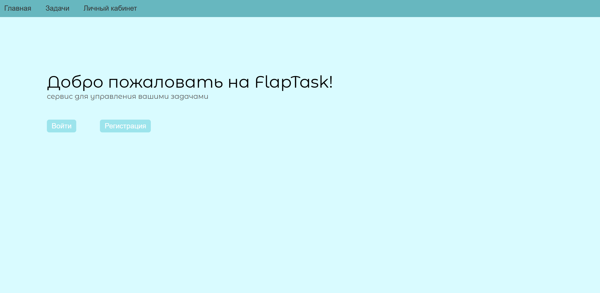
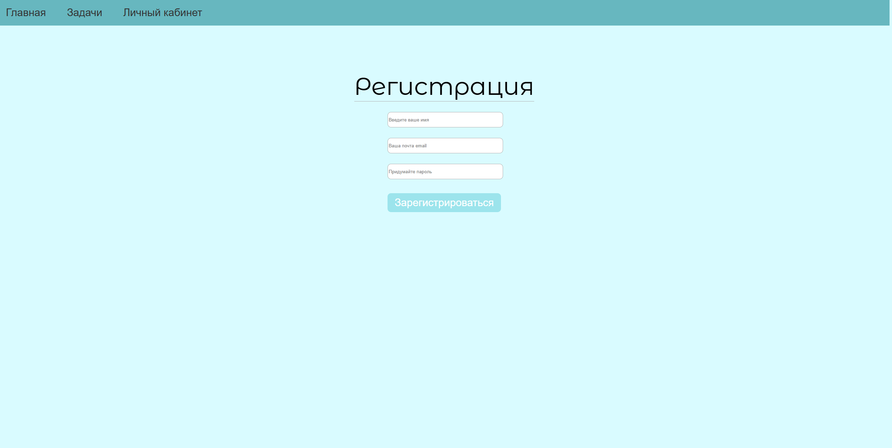
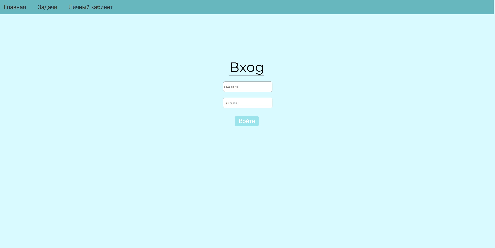
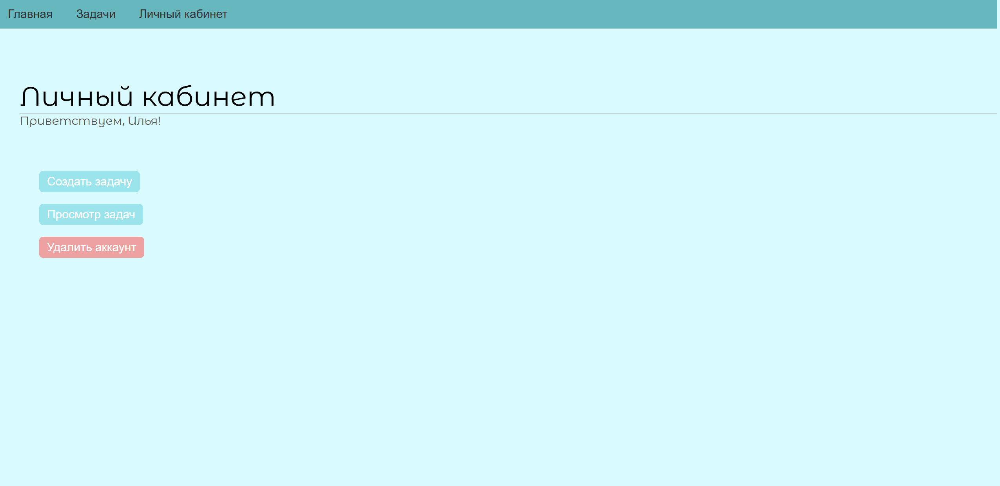
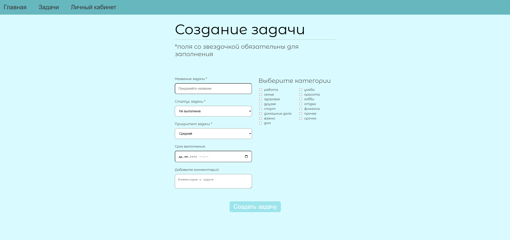
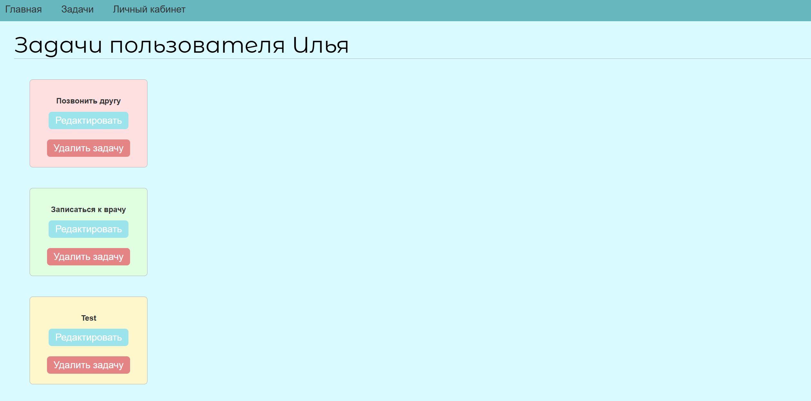
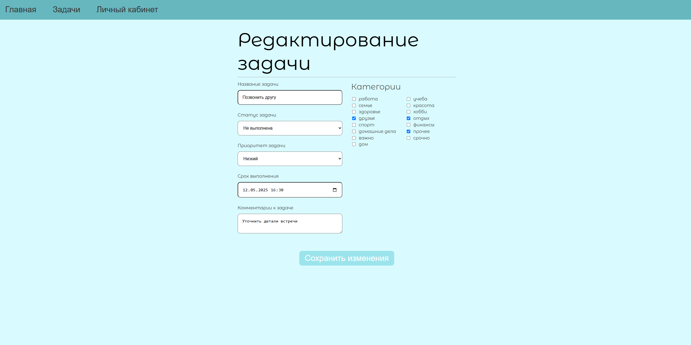
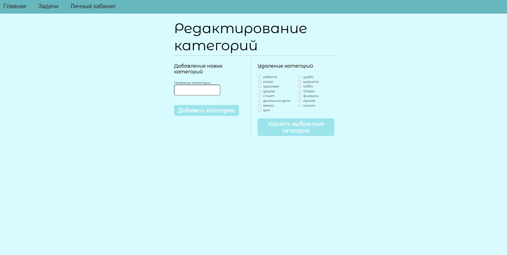

# Task Manager 'FlapTask'

**'FlapTask'** - это удобное и минималистичное веб-приложение на FastAPI, позволяющее пользователям эффективно управлять своими задачами: создавать, просматривать, редактировать и удалять. Все действия защищены авторизацией через токены и cookie.

Если нужно REST API приложение, полностью покрытое тестами - [См. этот проект](https://github.com/MaryKhm656/bank_account_app)

## Возможности

### Работа с пользователями
- Регистрация аккаунта (с хешированием пароля)
- Авторизация с использованием JWT-токенов (в куки)
- Удаление аккаунта

### Управление задачами
- Создание задач:
    - Название, статус, приоритет, дедлайн, комментарии
    - Привязка категорий
- Просмотр задач пользователя
- Редактирование и удаление задач (с каскадным удалением)

### Работа с категориями
- Создание/удаление категорий (доступно только `is_admin`)
- Привязка категорий к задачам

### Web-интерфейс
- Приветственная страница
- Регистрация и вход с использованием cookie
- Личный кабинет и просмотр задач
- Создание, редактирование и удаление задач
- Уведомления об успешных действиях

## Стек технологий

- **Backend:** FastAPI, SQLAlchemy, Jinja2
- **Frontend:** HTML + CSS (без JavaScript)
- **Database:** PostgreSQL
- **Хэширование паролей:** `passlib`
- **Работа с куки:** авторизация через cookie (без OAuth)

## Структура проекта
```bash
task-manager/                 
├── alembic/                         
├── app/
│   ├── web/
│   │   ├── __init__.py
│   │   ├── routes.py
│   ├── crud/
│   │   ├── __init__.py
│   │   ├── auth.py
│   │   ├── constants.py
│   │   ├── functions.py
│   │   └── security.py
│   ├── db/
│   │   ├── __init__.py
│   │   ├── database.py
│   │   └── models.py
│   └── __init__.py
├── static/
│   ├── image/
│   └── style.css
├── templates/
│   └── base.html
│   └── create-task.html
│   └── dashboard.html
│   └── delete-account-success.html
│   └── edit-categories.html
│   └── edit-task.html
│   └── home.html
│   └── login.html
│   └── register.html
│   └── task-creation-success.html
│   └── tasks.html
├── main.py
├── .gitignore
├── README.md
└── requirenments.txt
```

## Запуск проекта

- Клонируйте репозиторий
- Установите зависимости
- В терминале вашего IDE запустите приложение: ``` uvicorn main:app --reload ```
- Откройте в браузере: http://127.0.0.1:8000
- Жмякайте кнопки

## Скриншоты

### Приветственная страница


### Форма регистрации


### Вход


### Личный кабинет


### Создание задачи


### Просмотр задач


### Редактирование задачи


### Редактирование категорий(только `is_admin`)


## Автор
Разработано с ❤️ начинающим Python-разработчиком  
**Мария Хмельницкая**  
🔗 [GitHub: MaryKhm656](https://github.com/MaryKhm656)  
📧 nanoman66656@gmail.com